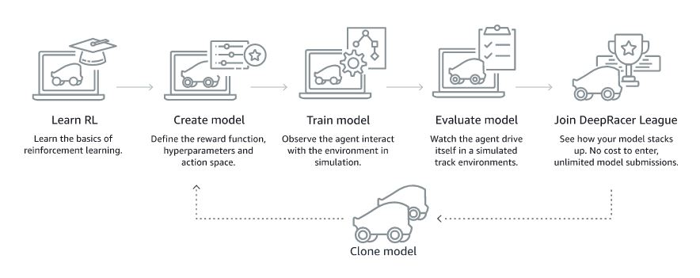
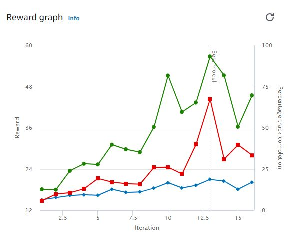

# AWSDeepRacer
What is AWS DeepRacer?
It is way to try your the ML Model in HandsOn on building reinforcement learning models. .
Build your model, evaluate its performance on a virtual track, and then compete in the AWS DeepRacer League.

Traning:
AWS DeepRacer leverages Amazon SageMaker to train your model behind the scenes and uses AWS RoboMaker to simulate the agent's interaction with the environment. Watch how the agent behaves in the chosen environment, as prescribed by the reward function.

So i have tried with two models:
# Model 1: 60 minutes Training 
This is where i have trained the model for 60 minutes where it completes 3 Laps in 06:35.173.

  

# Model 2: 360 minutes Training  
This is where i have trained the model for 60 minutes where it completes 3 Laps in 06:35.173.

  

# Training configuration
Gradient descent batch size	64

Entropy	0.01

Discount factor	0.999

Loss type	Huber

Learning rate	0.0003

Number of experience episodes between each policy-updating iteration	20

Number of epochs	10

#You can see the Source code at <a href="https://github.com/pradpant/AWSDeepRacer/tree/project">Project Branch </a>.
